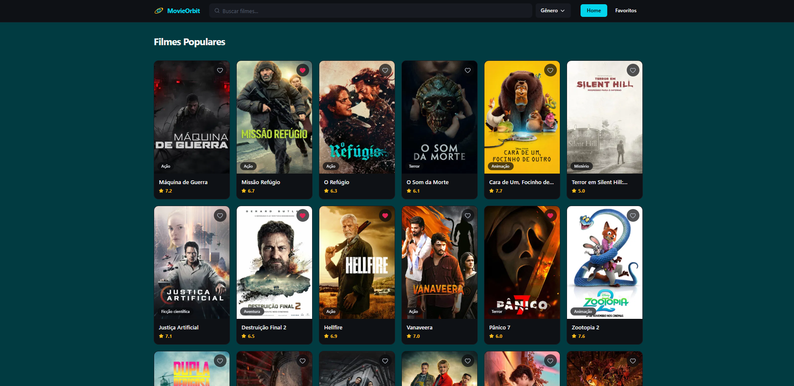
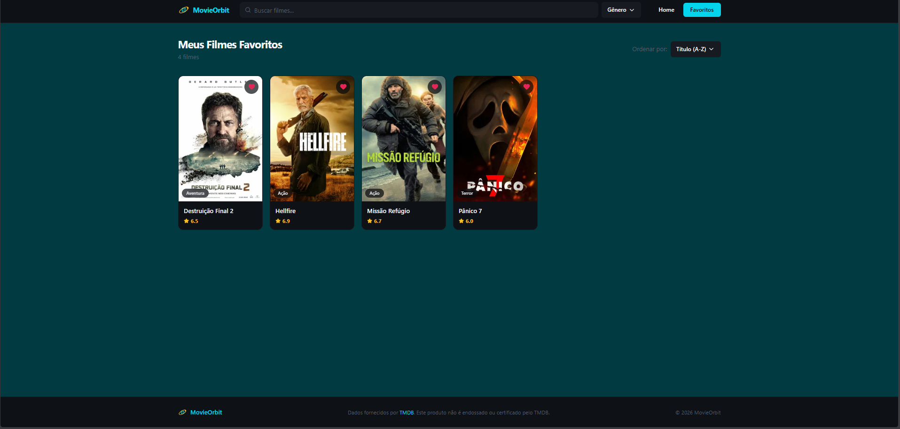
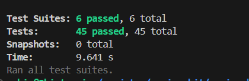

<div align="center">
  
  
  
  
  
</div>

<br />

<div align="center">
  <h1>🪐 MovieOrbit</h1>
  <p><strong>Explore. Favorite. Descubra.</strong></p>
  <p>Aplicação React desenvolvida como processo seletivo, que permite aos usuários explorar filmes, criar listas personalizadas de favoritos e descobrir novos conteúdos através da API do <a href="https://www.themoviedb.org/">The Movie Database (TMDB)</a>.</p>

  <br />

  <a href="https://movie-orbit-silk.vercel.app/">
    
  </a>
</div>

---

## 📋 Índice

- [Sobre o Projeto](#-sobre-o-projeto)
- [Tecnologias Utilizadas](#-tecnologias-utilizadas)
- [Pré-requisitos](#-pré-requisitos)
- [Por que pnpm?](#-por-que-pnpm)
- [Instalando o pnpm](#-instalando-o-pnpm)
- [Instalação e Execução](#-instalação-e-execução)
- [Testes](#-testes)
- [Estrutura do Projeto](#-estrutura-do-projeto)

---

## 🎬 Sobre o Projeto

O **MovieOrbit** é uma aplicação web moderna desenvolvida em React que consome a API pública do TMDB para oferecer uma experiência completa de descoberta de filmes. O usuário pode navegar por catálogos, pesquisar títulos, visualizar detalhes e montar suas próprias listas de favoritos.

> 💡 Este projeto foi desenvolvido como parte de um processo seletivo, com foco em boas práticas de desenvolvimento, organização de código, testes e uso de tecnologias modernas do ecossistema React.

---

## 📸 Screenshots

### 🏠 Home — Filmes Populares
> Navegue pelo catálogo de filmes populares, filtre por gênero e adicione aos favoritos diretamente pelo card.



---

### 🎬 Detalhes do Filme
> Veja sinopse, nota TMDB, data de lançamento, elenco principal, direção, produção e estúdios envolvidos.


---

### ❤️ Meus Favoritos
> Lista personalizada com todos os filmes favoritados, com suporte a ordenação por título.



---

### ✅ Cobertura de Testes
> **6 suites** e **45 testes** passando com sucesso em **9.6s**.



---

## 🛠 Tecnologias Utilizadas

### ⚛️ React
Biblioteca principal para construção da interface, utilizando componentes funcionais e hooks modernos (`useState`, `useEffect`, `useCallback`, etc.).

### 🗃️ Redux Toolkit
Gerenciamento de estado global da aplicação. Utilizado para controlar o estado dos filmes favoritos, filtros ativos e dados vindos da API, garantindo uma fonte única de verdade e fluxo de dados previsível.

### 🎨 Tailwind CSS
Framework utilitário de CSS que permite estilizar componentes de forma rápida e consistente diretamente no JSX, sem a necessidade de arquivos CSS separados. Garante um design responsivo com menos esforço.

### ✨ Prettier
Ferramenta de formatação automática de código. Garante consistência no estilo do código em todo o projeto, eliminando debates sobre formatação e facilitando a leitura em revisões de código.

### 🧪 Testes Unitários (Jest + React Testing Library)
Testes escritos com **Jest** como test runner e **React Testing Library** para simular a interação real do usuário com os componentes. Os testes garantem que as funcionalidades críticas funcionem conforme o esperado e evitam regressões.

---

## ✅ Pré-requisitos

Antes de começar, certifique-se de ter instalado em sua máquina:

- [Node.js](https://nodejs.org/) — versão **18** ou superior
- [pnpm](https://pnpm.io/) — veja como instalar na seção abaixo
- Uma chave de API válida do [TMDB](https://developer.themoviedb.org/docs/getting-started)

---

## 📦 Por que pnpm?

O **pnpm** (Performant NPM) é um gerenciador de pacotes Node.js que se destaca em relação ao `npm` e ao `yarn` por três razões principais:

| Característica | npm / yarn | pnpm |
|---|---|---|
| **Espaço em disco** | Duplica dependências em cada projeto | Armazena uma única cópia global e cria links simbólicos |
| **Velocidade de instalação** | Mais lenta | Significativamente mais rápida |
| **Segurança** | Permite acesso a pacotes não declarados | Isola estritamente as dependências declaradas |

> Em projetos com várias dependências, o pnpm pode economizar **gigabytes** de espaço em disco ao compartilhar pacotes entre projetos via seu store global, em vez de duplicá-los em cada `node_modules`.

---

## 📥 Instalando o pnpm

Escolha o método de acordo com o seu sistema operacional:

### Windows (PowerShell)
```powershell
iwr https://get.pnpm.io/install.ps1 -useb | iex
```

### macOS / Linux
```bash
curl -fsSL https://get.pnpm.io/install.sh | sh -
```

### Via npm (qualquer sistema)
```bash
npm install -g pnpm
```

Após a instalação, verifique se está funcionando corretamente:
```bash
pnpm --version
```

> 📖 Para mais detalhes, consulte a [documentação oficial do pnpm](https://pnpm.io/installation).

---

## 🚀 Instalação e Execução

### 1. Clone o repositório

```bash
git clone https://github.com/seu-usuario/movieOrbit.git
cd movieOrbit
```

### 2. Instale as dependências

```bash
pnpm install
```

### 3. Configure as variáveis de ambiente

Crie um arquivo `.env` na raiz do projeto com base no arquivo de exemplo:

```bash
cp .env.example .env
```

Preencha com sua chave da API do TMDB:

```env
VITE_TMDB_API_KEY=sua_chave_aqui
VITE_TMDB_BASE_URL=https://api.themoviedb.org/3
```

### 4. Execute o projeto em modo de desenvolvimento

```bash
pnpm dev
```

A aplicação estará disponível em `http://localhost:5173`.

### Scripts disponíveis

| Comando | Descrição |
|---|---|
| `pnpm dev` | Inicia o servidor de desenvolvimento |
| `pnpm build` | Gera o build de produção |
| `pnpm preview` | Visualiza o build de produção localmente |
| `pnpm test` | Executa os testes unitários |
| `pnpm test:coverage` | Executa os testes com relatório de cobertura |
| `pnpm lint` | Analisa o código com ESLint |
| `pnpm format` | Formata o código com Prettier |

---

## 🧪 Testes

O projeto utiliza **Jest** em conjunto com a **React Testing Library** para garantir a qualidade do código.

### Executar todos os testes

```bash
pnpm test
```

### Executar com watch mode (recomendado durante o desenvolvimento)

```bash
pnpm test --watch
```

### Gerar relatório de cobertura

```bash
pnpm test:coverage
```

---

## 📁 Estrutura do Projeto

```
movieOrbit/
├── public/                  # Arquivos estáticos públicos
├── src/
│   ├── __tests__/           # Testes unitários (Jest + RTL)
│   ├── components/          # Componentes reutilizáveis da UI
│   ├── features/            # Módulos por funcionalidade (Redux slices, lógica de domínio)
│   ├── lib/                 # Configurações e instâncias de bibliotecas externas
│   ├── pages/               # Páginas da aplicação
│   ├── routes/              # Configuração de rotas
│   ├── store/               # Configuração da store Redux
│   ├── styles/              # Estilos globais
│   ├── test/                # Utilitários e configurações de teste
│   ├── utils/               # Funções utilitárias
│   ├── App.tsx
│   └── main.tsx
├── .env                     # Variáveis de ambiente
├── .gitignore
├── .prettierrc              # Configuração do Prettier
├── components.json          # Configuração de componentes (shadcn/ui)
├── eslint.config.js         # Configuração do ESLint
├── index.html
├── jest.config.cjs          # Configuração do Jest
├── tailwind.config.ts       # Configuração do Tailwind CSS
├── package.json
└── README.md
```

---

<div align="center">
  <p>Feito com ❤️ e ☕ por <strong>Enzo Shiotuqui</strong></p>
  <p>
    <a href="https://github.com/Eshiotuqui">GitHub</a> •
    <a href="https://www.linkedin.com/in/enzo-shiotuqui-385324266/">LinkedIn</a>
  </p>
</div>
